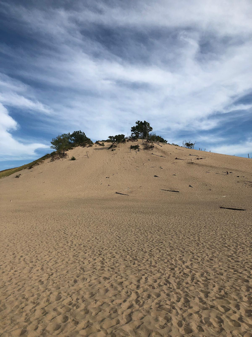
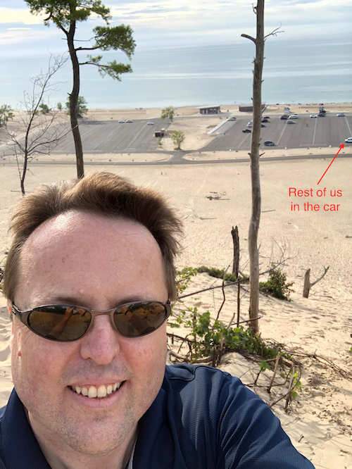

# Mohammed Abdulghani
Director and pain in Scott's neck. Rebel among his directs. The one with the empty playlist

# Memories with Scott Horn
Hands down it would be our infamous road trip. Honestly, the story behind this is some what interesting. We had initially planned for Scott+directs offsite in Chicago. But then the idea of a road trip brewed in Scott's mind and the rest is history. Best team offiste ever!

# Story time!
Scott will not "Go with the flow". He's more of a Salmon, "Up the river". As you can see in the picture here, it's up the dune!

Rest of us looking up at Scott.

Him, Looking down at us!

## Things only Scott Says

- How would *you* do it? (emphasis on you, when he's given a suggestion to do something) 
- What's the value of doing it?

## What I Will Miss About Scott
- His persistance to realize the fullest potential to his ideas.
- His extremely candid nature
- His faith in people to improve beyond what they see in themselves
- GP/maker 

## Anything Else?
The most challenging boss I had who pushed me the hardest and I enjoyed every bit. Also, this page is now on Confluence :) https://confluence.expedia.biz/display/~mabdulghani/Goodbye+Scott
